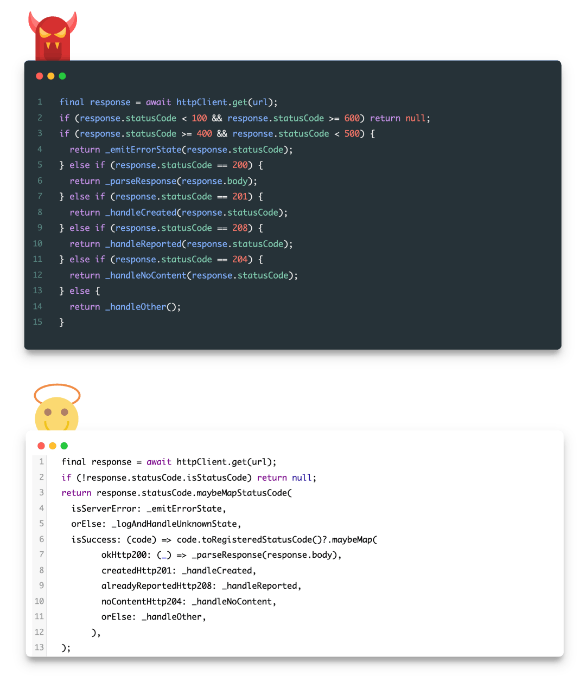

This pure Dart and and dependency-free package provides functionality for working with HTTP status codes in a functional programming style.

## Features



* Extends `num` types with helper functional methods (when, map, maybeWhen, etc.) for handling HTTP status codes.
* Provides `StatusCode` enum for easy handling of all [IANA registered HTTP status codes](https://www.iana.org/assignments/http-status-codes/http-status-codes.xml) (also in functional style).
* Provides methods for parsing HTTP status codes from `String` and `num` types, and much more.

## Getting started

To use this package, add `functional_status_codes` as a dependency in your `pubspec.yaml` file.

```yaml
dependencies:
  functional_status_codes: ^1.0.0
```

Then import the package in your Dart code:

```dart
import 'package:functional_status_codes/functional_status_codes.dart';
```

## Usage

Use your favorite HTTP client libraries such as `http` or `dio` and take advantage of this package's functional API to easily handle HTTP status codes in your Dart project.

```dart
final statusCode = response.statusCode; // 200, int status code of response.
final isSuccess = statusCode.maybeMapStatusCode(
  isSuccess: (_) => _parseResponse(response.body),
  isClientError: (code) => _handleError(code),
  isServerError: (code) => _handleError(code),
  orElse: () => _handleUnknowResponse(response),
);
print(isSuccess); // Output: true
```

## Additional information

For more information on using this package, check out the API documentation.

If you have any issues or suggestions for the package, please file them in the GitHub repository.
